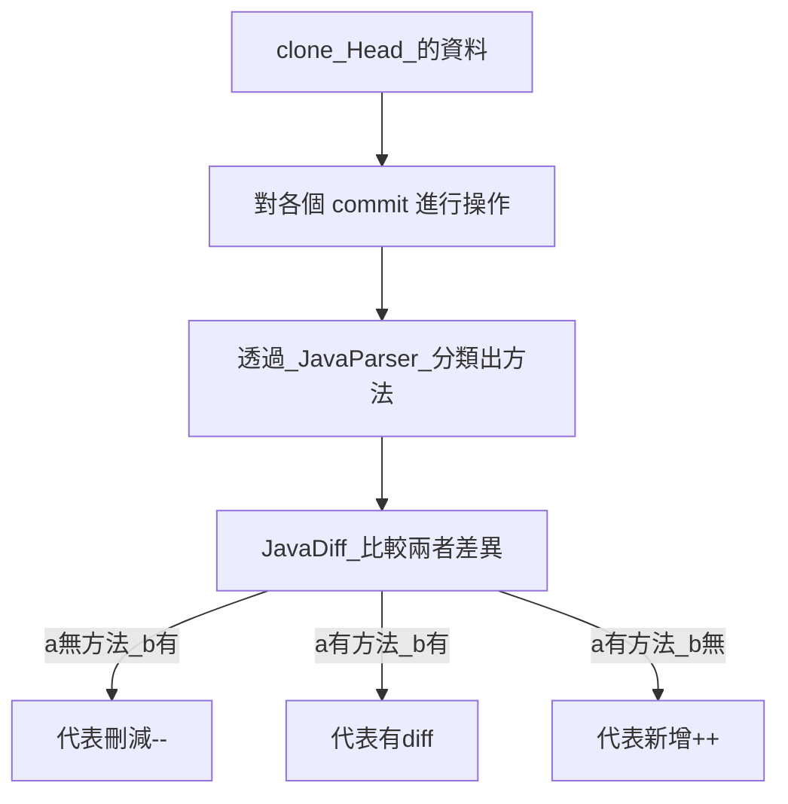

# CodeMangeSystem_ForNSTCproject

[You can see hackmd in here](https://hackmd.io/@ruserxd/rJGP1-6RR)

# 目錄
- [配置](#使用此項專案的設置)
    - [Frotend](#Frontend)
    - [Backend](#Backend)
- [Git Process](#GitProcess)
    - [Git Cloner](#GitCloner)

# 使用此項專案的設置

## 個人使用工具
- macbook air m2
- vscode
- IntelliJ IDEA 2022.2.5 (Ultimate Edition)
## Docker 一鍵配置
1. 依照目錄下的 .env.example 的要求，填入資料庫的相關 URL, USERNAME, PASSWORD
2. Backend 進行 Maven 打包操作 (日後也加入 Docker 中)
3. 在目錄下依序執行 
    - docker-compose build
    - docker-compose up
## Frontend
在開始設置本專案之前，請確保您的本地環境已經安裝以下工具：
- React
- yarn
- ngrok

請先確保以上的都有事先安裝於 local

### 概念
React 當作我們的前端框架

yarn 當作前端依賴管理工具

ngrok 負責讓後端為公開伺服器

---
開始步驟:
1. 打開電腦上的 terminal
    ```
    ngrok http http://localhost:8080
    ```
2. 開啟伺服器，將 ngrok 獲得的網址修改於 api/axiosConfig.js 的 baseURL

3. cd 到 frontend 的資料夾，安裝配置
    ```
    yarn install
    ```
4. `yarn start` 即可開啟網頁

---

## Backend

### 概念
Spring Boot 當作後端的框架

SQl 當作系統的資料庫

env 管理環境設定

有寫一個 .env.example

請將開設好的 sql 的資訊 (urlname, username, passwrod) 填入並創立一個 .env 檔案

記得寫好 env 將 Run Configurations 的 Enable EnvFile 設置打開


## GitProcess

### GitCloner
Clone 的示意圖

```mermaid
graph TD;
clone_資料 --> 本地端無資料_執行clone;
clone_資料 --> 本地端有資料_執行pull;
本地端無資料_執行clone--> clone資料到本地端;
本地端有資料_執行pull --> pull本地端資料
clone資料到本地端 --> 將資料分類存入SQL;
pull本地端資料 --> 透過GitTree更新SQL內容;
   ```


### GitDiffAnalyzer

Git 的歷程示意圖
```mermaid
gitGraph
       commit
       commit
       commit
       commit
```
目前的做法是先將 3(Head) 的部分 clone 下來，接著一個一個去比對

ex. 3 <-> 2, 2 <-> 1, 1 <-> 0

分析示意圖 (a 代表較新的版本, b 代表較舊的版本)



## 許可證

本專案採用 MIT 許可證。詳情請見 [LICENSE](LICENSE) 檔案。
